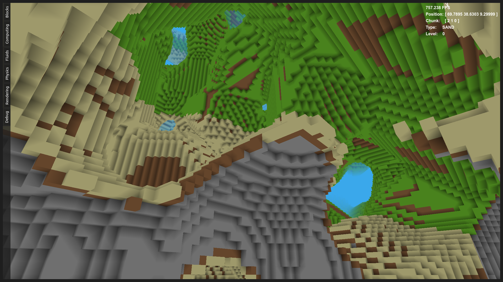
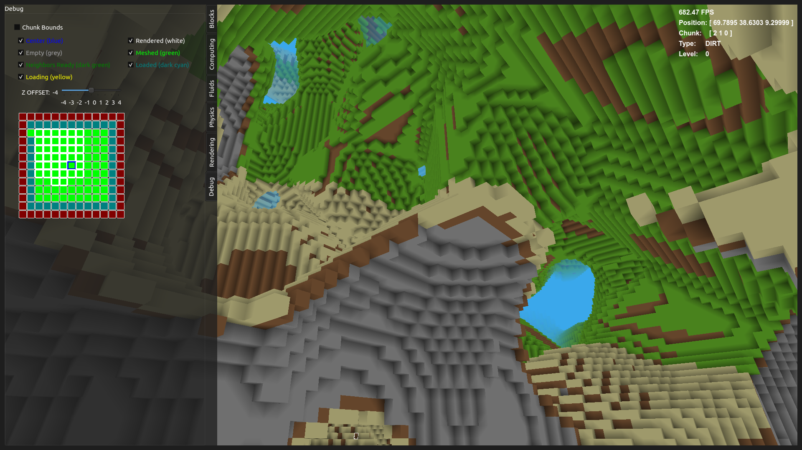

# cpu-game

An experimental voxel rendering engine built in 2018 with C++20, Qt, and OpenGL 4.6. Originally inspired by Notch's [0x10c](https://en.wikipedia.org/wiki/0x10c), the plan was to embed programmable virtual 16-bit computer components (CPUs, memory, I/O devices) directly into a Minecraft-like world -- hence the name. The in-game computer simulation exists in early form, but the project evolved primarily into a voxel engine testbed for chunk management, terrain generation, multithreaded meshing, and rendering techniques.




## Features

**Voxel Engine**
- 32x32x32 block chunks with hash-based spatial indexing
- Async chunk loading, saving, and generation via thread pools
- Region-file world persistence (create, load, and delete worlds from UI)
- Greedy mesh generation with per-vertex ambient occlusion

**Terrain Generation**
- Multiple terrain types: Dirt Ground, Perlin World, Perlin, Perlin Caves, Test
- Seed-based procedural generation using FastNoise (Simplex noise, fractal octaves)
- Minecraft-inspired cave culling algorithm

<!-- TODO: caves screenshot once terrain is more interesting -->

**Rendering**
- OpenGL 4.6 core profile with 16 GLSL shaders
- Frustum culling (~2x framerate improvement)
- Distance fog with directional scaling
- Wireframe and chunk boundary debug visualizations
- Optional GPU ray tracing via compute shaders
- Texture atlas for block faces

<!-- TODO: chunk debug screenshot -->

**Fluid Simulation** (non-functional)
- Per-chunk water and lava simulation
- Flow physics with spreading and evaporation
- Cross-chunk boundary flow
- Separate fluid mesh rendering with transparency

**Player & Tools**
- First-person movement with AABB collision and gravity
- Block placement and destruction with ray casting
- Sphere, cube, and line tools for bulk editing
- God mode with extended reach

**Virtual Computer Components** (non-functional)
- Placeable CPU, Memory, and I/O Device blocks with 3D models
- Stub CPU simulator and memory system inspired by 0x10c's DCPU-16

**UI**
- Qt-based menu system for world creation, loading, and deletion
- In-game HUD overlay with debug info
- Pause menu and render/system settings panels

## Building

Requires:
- C++20 compiler (GCC recommended)
- Qt 5+ (Core, GUI, Widgets, OpenGL modules)
- OpenGL 4.6 capable GPU and drivers

```bash
qmake cpugame.pro
make -j$(nproc)
```

## Usage

```bash
./cpugame [options]
```

| Flag | Description |
|------|-------------|
| `-n <threads>` | Number of threads |
| `-w <world_name>` | World name to load/create |
| `-s <seed>` | World generation seed |
| `-t` | Test mode |
| `-p` | Print world |

Worlds can also be created and loaded from the in-game menu.

### Controls

| Key | Action |
|-----|--------|
| WASD | Move |
| Space | Jump |
| Shift | Sneak |
| Mouse | Look around |
| Left click | Break block |
| Right click | Place block |
| Scroll wheel | Cycle block type / tool |

### Configuration

Runtime defaults in `config/defaults.cfg`:

```
WORLD_NAME    new-world
TERRAIN       Perlin
SEED          0
CHUNK_RAD_X   4
CHUNK_RAD_Y   4
CHUNK_RAD_Z   4
LOAD_THREADS  4
MESH_THREADS  4
```

Compile-time parameters (player physics, timesteps, FOV) in `config/params.hpp`.

## Architecture

The engine uses a multithreaded component-based architecture:

- **Main/Qt thread** -- rendering, UI, event handling
- **Physics thread** -- player movement and collision (10ms timestep)
- **Block update thread** -- block simulation logic (50ms timestep)
- **Mesh worker pool** -- parallel chunk mesh generation
- **Chunk loader pool** -- async chunk I/O and terrain generation

Key systems: `VoxelEngine` orchestrates `World`, `Player`, `MeshRenderer`, and `ChunkLoader`. The `World` manages a `ChunkMap` (hash map of chunks), `FluidManager`, and terrain generation. Chunks are loaded/unloaded dynamically based on player position within a configurable radius.

## License

See [LICENSE](LICENSE) for details.

## Note

This README was generated using Claude Opus 4.6.
